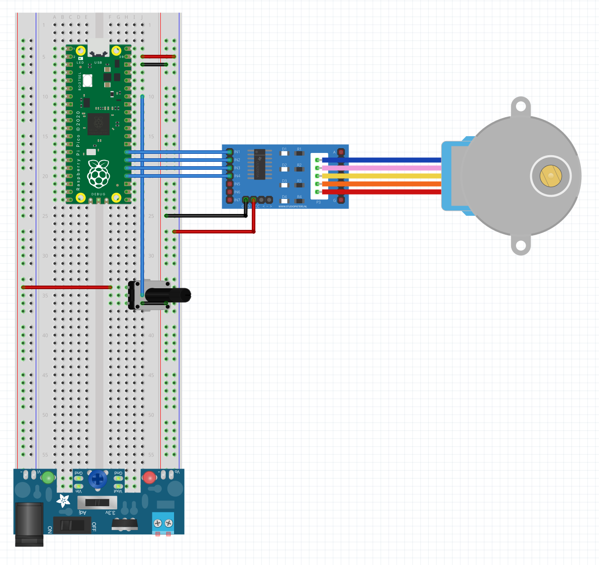

# Rotating Cat Toy with Pi Pico

A rotating cat toy similar to the [SmartyKat Hot Pursuit](https://www.chewy.com/smartykat-hot-pursuit-electronic/dp/15966) and [Cat's Meow](https://www.chewy.com/cats-meow-motorized-chaser-cat-toy/dp/804382) with adjustable speed.

## Parts

- Pi Pico W
- HW-131 power supply
- 28BYJ-48 stepper motor and ULN2003A stepper driver board
- Potentiometer

## Wiring Diagram

